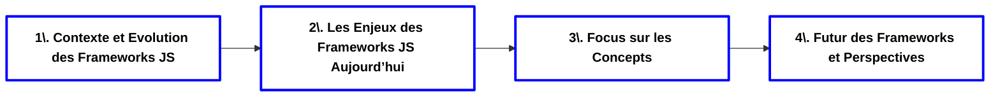

**Objectifs :**
- Comprendre ce qu'est un framework JavaScript
- Analyser les avantages et les inconvénients des frameworks actuels
- Explorer les perspectives futures des frameworks JavaScript

**Plan :**

