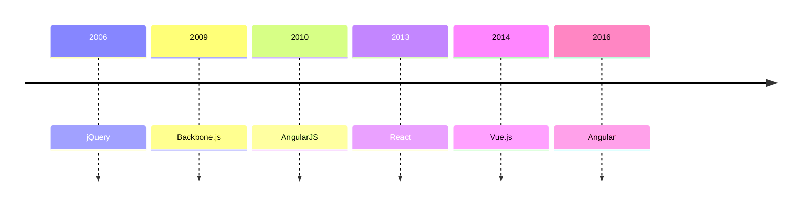

# Contexte et Évolution

## Les origines des frameworks JS

<v-clicks>

- Fin des années 2000 : besoin de structure
- jQuery : première révolution
- AngularJS : application web complète
- Backbone.js : organisation du code
- Explosion post-2010

</v-clicks>

::right::

<v-clicks>

## Timeline clé

</v-clicks>

