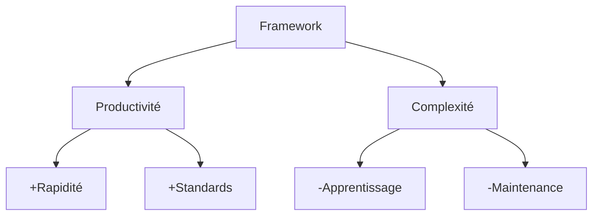

# Les Enjeux Aujourd'hui

## Productivité vs Complexité

<v-clicks>

### Gains
- Développement accéléré
- Outils standardisés
- Réutilisation du code
- Tests simplifiés

### Pertes
- Complexité accrue
- Choix difficiles
- Courbe d'apprentissage
- Maintenance complexe

</v-clicks>

::right::

<v-clicks>

</v-clicks>

