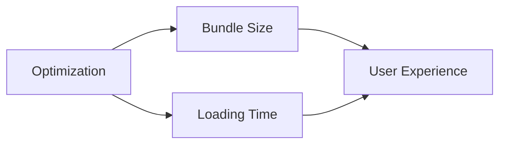

# Performance et Impact Utilisateur

<v-clicks>

## Défis
- Taille des bundles
- Temps de chargement
- First Paint / TTI
- Performance mobile

## Solutions Modernes
- Frameworks légers (Svelte)
- Build tools optimisés (Vite)
- Tree shaking avancé
- Lazy loading intelligent

</v-clicks>