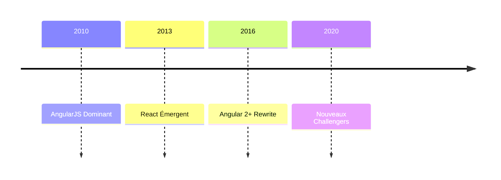

# L'Effet "Hype" et Obsolescence

<v-clicks>

## Cycle de vie des frameworks

```mermaid {scale: 0.9}
timeline
    2010 : AngularJS Dominant
    2013 : React Émergent
    2016 : Angular 2+ Rewrite
    2020 : Nouveaux Challengers
```

## Points clés
- Évolution rapide
- Choix stratégiques
- Pérennité technique
- ROI technologique

</v-clicks>