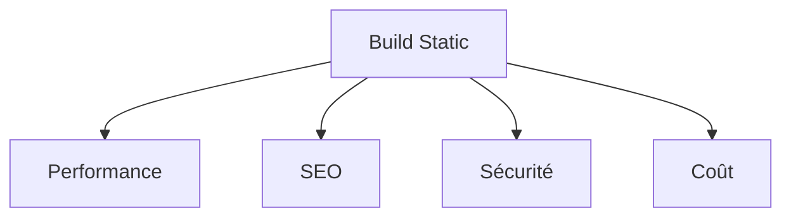

# Frameworks Fullstack

<v-clicks>

## Solutions SSR
- Next.js (React)
- Nuxt.js (Vue)
- SvelteKit

## Sites Statiques
- Gatsby
- Astro
- 11ty

</v-clicks>

::right::

<v-clicks>

## Avantages Build-time

</v-clicks>

