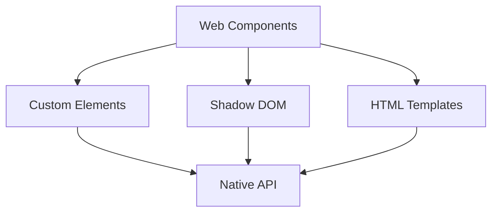

# Minimalisme et Efficacité

<v-clicks>

## Frameworks Légers

**Svelte** : Compile en JavaScript pur, éliminant le Virtual DOM pour des performances optimisées.

**Solid.js** : Réactivité fine-grain, met à jour uniquement les parties nécessaires de l'UI.

**Preact** : Alternative légère à React, conserve l'API avec une empreinte réduite.

## Build Tools Modernes

**Vite** : Compilation à la demande, accélère le développement avec des temps de démarrage réduits.

**esbuild** : Bundler ultra-rapide, idéal pour les builds fréquents grâce à sa vitesse.

</v-clicks>

::right::

<v-clicks>

## Web Components Natifs

</v-clicks>

