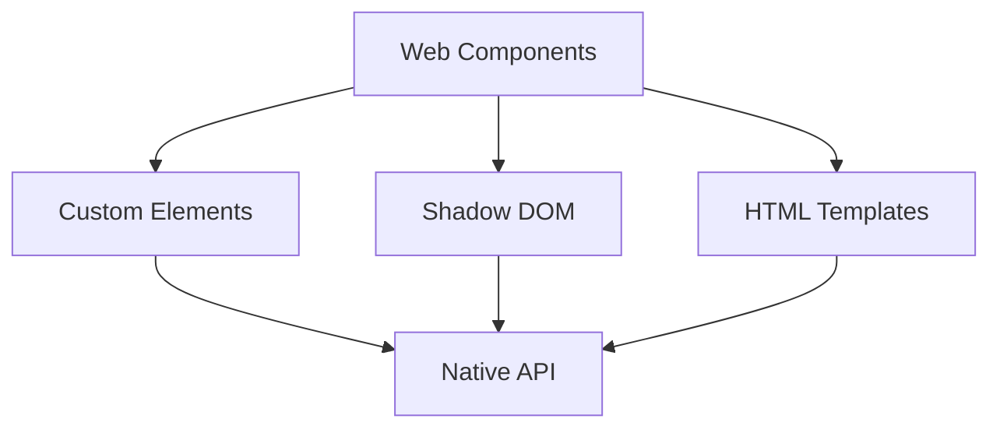

# Minimalisme et Efficacité

<v-clicks>

## Frameworks Légers
- Svelte
- Solid.js
- Preact
- Lit

## Build Tools Modernes
- Vite
- esbuild
- Turbopack
- Rollup

</v-clicks>

::right::

<v-clicks>

## Web Components Natifs

</v-clicks>

