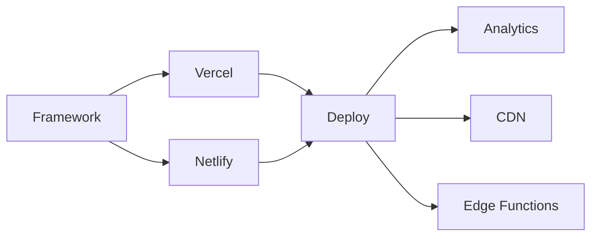

# Unification des Écosystèmes

<v-clicks>

## Next.js comme Framework Universel
- SSR / SSG
- API Routes
- Middleware
- Images / Fonts
- Analytics

## Intégration Cloud Native

```mermaid {scale: 0.8}
graph LR
    A[Framework] --> B[Vercel]
    A --> C[Netlify]
    B --> D[Deploy]
    C --> D
    D --> E[Analytics]
    D --> F[CDN]
    D --> G[Edge Functions]
```

</v-clicks>