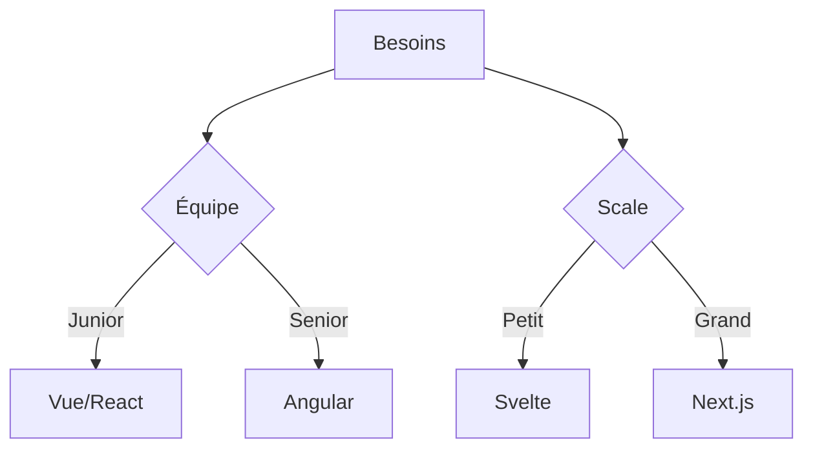

# Synthèse

<v-clicks>

## Points Clés
- Simplification du développement
- Nouvelles problématiques
- Choix stratégiques
- Evolution constante

## Critères de Choix
- Taille de l'équipe
- Type de projet
- Performance requise
- Maintenance
</v-clicks>

::right::

<v-clicks>

## Matrice Décisionnelle

</v-clicks>

